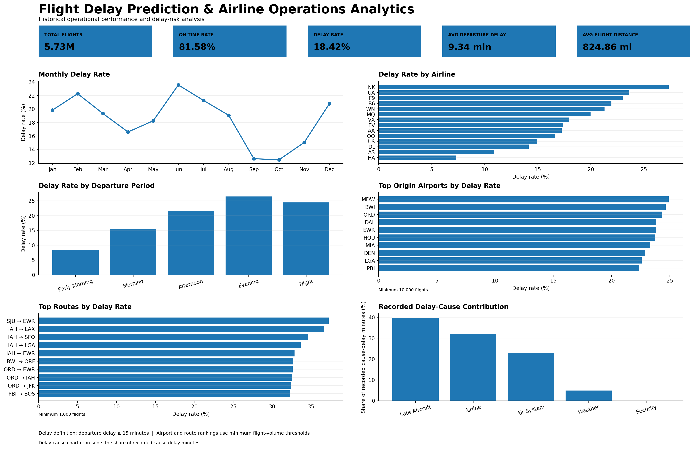

# ✈️ Flight Delay Prediction & Airline Operations Analytics

An end-to-end **Data Analytics and Machine Learning** project that analyzes **5.7M+ US flight records** to identify delay patterns, operational hotspots, and predict departure delays using information available before departure.

---

## 📌 Project Overview

Flight delays can affect airline operations, aircraft utilization, scheduling efficiency, and passenger experience.

This project analyzes historical flight data to understand how departure delays vary across **airlines, airports, routes, months, and departure periods**, while also developing a machine learning model to predict whether a flight is likely to be delayed.

The project combines:

- Data Cleaning
- Exploratory Data Analysis
- Operational KPI Analysis
- Feature Engineering
- SQL Business Analysis
- Machine Learning
- Model Evaluation
- Data Visualization
- Business Recommendations

### 🎯 Prediction Objective

Predict whether a flight will experience a **departure delay of 15 minutes or more**.

```text
is_delayed = 1  → Departure delay ≥ 15 minutes
is_delayed = 0  → Departure delay < 15 minutes
```

---

## 📊 Key Results

After removing cancelled flights:

| Metric                  |        Result |
| ------------------------ | -------------: |
| Total Flights            |  **5,729,195** |
| Delayed Flights          |  **1,055,500** |
| On-Time Flights          |  **4,673,695** |
| Delay Rate               |     **18.42%** |
| On-Time Rate              |     **81.58%** |
| Average Departure Delay  |   **9.34 min** |
| Average Flight Distance  |  **824.86 mi** |

---

## 🛠️ Tech Stack

| Category          | Technologies           |
| ------------------ | ----------------------- |
| Programming        | Python                  |
| Data Manipulation  | Pandas, NumPy           |
| Visualization      | Matplotlib, Seaborn     |
| Machine Learning   | Scikit-learn, XGBoost   |
| SQL                | SQLite                  |
| Development        | Jupyter Notebook        |
| Version Control    | Git, GitHub             |

---

## 📁 Dataset

The project uses the **US Department of Transportation flight dataset**, containing approximately **5.8 million flight records from 2015**.

Supporting datasets include:

* Flight information
* Airline information
* Airport information

The complete raw flight dataset is **not included in this repository** because of its large size.

---

# 🔄 Project Workflow

```text
                    Flight Dataset
                         │
                         ▼
                  Data Understanding
                         │
                         ▼
                    Data Cleaning
                         │
                         ▼
              Exploratory Data Analysis
                         │
                         ▼
              Operational KPI Analysis
                         │
                         ▼
                Feature Engineering
                         │
             ┌───────────┴───────────┐
             ▼                       ▼
       SQL Analysis           ML Preparation
                                     │
                                     ▼
                       Chronological Data Split
                                     │
                                     ▼
                              XGBoost Model
                                     │
                                     ▼
                            Model Evaluation
                                     │
                    ┌────────────────┴───────────────┐
                    ▼                                ▼
             Business Insights              Operational Dashboard
```

---

# 🧹 1. Data Preparation

The raw dataset contains cancelled and non-cancelled flights.

Cancelled flights were excluded because they do not have a meaningful departure-delay outcome.

```python
df = flights.copy()

df = df[df['CANCELLED'] == 0].copy()

df['is_delayed'] = (
    df['DEPARTURE_DELAY'] >= 15
).astype(int)
```

This produced:

```text
5,729,195 non-cancelled flights
```

### Delay Definition

A flight is classified as delayed when:

```text
Departure Delay >= 15 minutes
```

This creates a binary classification target for the machine learning model.

---

# 📈 2. Exploratory Data Analysis

The project analyzes delay patterns across multiple operational dimensions.

## Airline Performance

Historical delay rates varied considerably across airlines.

| Airline | Delay Rate |
| ------- | ---------: |
| NK      |     27.35% |
| UA      |     23.63% |
| F9      |     23.00% |
| B6      |     21.94% |
| WN      |     21.29% |
| MQ      |     19.99% |
| VX      |     17.96% |
| EV      |     17.36% |
| AA      |     17.26% |
| OO      |     16.65% |
| US      |     14.93% |
| DL      |     14.14% |
| AS      |     10.87% |
| HA      |      7.33% |

These values represent **historical observed delay rates** and should not be interpreted as causal effects.

---

## Monthly Delay Trends

Delay rates showed noticeable variation across the year.

| Month     | Delay Rate |
| --------- | ---------: |
| January   |     19.83% |
| February  |     22.27% |
| March     |     19.33% |
| April     |     16.59% |
| May       |     18.24% |
| June      | **23.57%** |
| July      |     21.27% |
| August    |     19.06% |
| September |     12.62% |
| October   | **12.47%** |
| November  |     15.03% |
| December  |     20.78% |

**June recorded the highest historical delay rate, while October recorded the lowest.**

---

## Day-of-Week Analysis

Historical delay rates by day of week:

| Day       | Delay Rate |
| --------- | ---------: |
| Monday    |     19.56% |
| Tuesday   |     18.04% |
| Wednesday |     17.85% |
| Thursday  |     19.33% |
| Friday    |     18.92% |
| Saturday  |     16.39% |
| Sunday    |     18.48% |

The differences are relatively modest compared with the variation observed across departure periods.

---

## Departure Period Analysis

Scheduled departure times were grouped into operational periods:

```text
Early Morning → 05:00–08:59
Morning       → 09:00–12:59
Afternoon     → 13:00–16:59
Evening       → 17:00–20:59
Night         → 21:00–04:59
```

| Departure Period | Delay Rate |
| ----------------- | ---------: |
| Early Morning     |  **8.51%** |
| Morning           |     15.57% |
| Afternoon         |     21.47% |
| Evening           | **26.44%** |
| Night             |     24.43% |

The analysis shows a clear historical pattern of **higher delay rates for later scheduled departures**.

---

# 🛫 3. Airport Analysis

Airport-level performance was analyzed using origin airports.

To avoid rankings based on very small samples, airports were filtered to those with at least **10,000 flights**.

Top observed delay-rate airports included:

| Airport | Delay Rate |
| ------- | ---------: |
| MDW     |     24.91% |
| BWI     |     24.64% |
| ORD     |     24.36% |
| DAL     |     23.84% |
| EWR     |     23.82% |
| HOU     |     23.74% |
| MIA     |     23.33% |
| DEN     |     22.87% |
| LGA     |     22.58% |
| PBI     |     22.35% |

These results identify **historical operational hotspots** that could be investigated further.

---

# 🛣️ 4. Route Analysis

Routes were constructed using:

```text
ORIGIN_AIRPORT → DESTINATION_AIRPORT
```

Routes with at least **1,000 flights** were considered for ranking.

Examples of high historical delay-rate routes:

| Route     | Delay Rate |
| --------- | ---------: |
| SJU → EWR |     37.27% |
| IAH → LAX |     36.67% |
| IAH → SFO |     34.58% |
| IAH → LGA |     33.67% |
| IAH → EWR |     32.88% |
| BWI → ORF |     32.74% |
| ORD → EWR |     32.62% |
| ORD → IAH |     32.60% |
| ORD → JFK |     32.40% |
| PBI → BOS |     32.29% |

These are **historical associations**, not evidence that the route itself causes delays.

---

# ⚠️ 5. Delay Cause Analysis

Recorded delay-cause fields were analyzed to understand the distribution of recorded cause-delay minutes.

| Delay Cause   | Contribution |
| -------------- | ------------: |
| Late Aircraft  |    **39.84%** |
| Airline        |    **32.20%** |
| Air System     |    **22.88%** |
| Weather        |         4.95% |
| Security       |         0.13% |

Late-aircraft and airline-related categories together represented approximately:

```text
72.04%
```

of recorded cause-delay minutes.

> **Note:** These percentages describe the recorded delay-cause data and should not be interpreted as independent causal effects.

---

# 🤖 6. Machine Learning

## Target Variable

```text
is_delayed
```

### Classification Rule

```text
1 → Departure Delay ≥ 15 minutes
0 → Departure Delay < 15 minutes
```

---

## Feature Engineering

The model uses information that can be available **before the scheduled departure**.

### Features

* Month
* Day
* Day of week
* Airline
* Origin airport
* Destination airport
* Scheduled departure
* Scheduled flight duration
* Distance
* Departure hour
* Departure period

---

## 🔒 Leakage Prevention

Post-departure information was deliberately excluded from the prediction model.

The following variables were **not used as prediction features**:

* `DEPARTURE_DELAY`
* `ARRIVAL_DELAY`
* `ARRIVAL_TIME`
* `WHEELS_OFF`
* `WHEELS_ON`
* `TAXI_OUT`
* `TAXI_IN`
* `AIR_SYSTEM_DELAY`
* `SECURITY_DELAY`
* `AIRLINE_DELAY`
* `LATE_AIRCRAFT_DELAY`
* `WEATHER_DELAY`

This ensures the model does not use information that would only be known after the flight operation has already occurred.

---

# ⏱️ 7. Chronological Model Validation

Because flight operations are time-dependent, the data was split chronologically rather than randomly.

```text
Historical Flights
       │
       ▼
Training Set
       │
       ▼
Validation Set
       │
       ▼
Final Test Set
```

The validation set was used for model/threshold decisions.

The final test set was kept untouched until final evaluation.

This provides a more realistic estimate of performance on future observations.

---

# 🌳 8. XGBoost Model

An **XGBoost binary classification model** was trained using:

* Native categorical features
* Class weighting
* Histogram-based tree construction
* Chronological validation
* Probability threshold selection

The final model used:

```text
n_estimators = 500
max_depth = 6
learning_rate = 0.05
subsample = 0.8
colsample_bytree = 0.8
```

---

# 📊 9. Model Performance

Final performance on the untouched chronological test set:

| Metric    |      Score |
| --------- | ---------: |
| Accuracy  | **60.38%** |
| Precision | **23.97%** |
| Recall    | **60.95%** |
| F1 Score  | **34.41%** |
| ROC-AUC   | **64.89%** |

The model demonstrates **moderate predictive signal** for identifying potential departure delays.

Because delayed flights represent a minority of observations, accuracy alone can be misleading. Therefore, **precision, recall, F1-score, and ROC-AUC** were considered when evaluating the model.

---

# 🧮 10. SQL Business Analysis

The cleaned flight dataset was loaded into **SQLite** to perform business-oriented SQL analysis.

SQL analysis covered:

### Airline Performance

* Total flights
* Delayed flights
* Delay rate
* Average departure delay

### Monthly Performance

* Monthly flight volume
* Delayed flights
* Delay rate
* Average departure delay

### Airport Performance

* Flight volume
* Delay rate
* Average departure delay

### Route Performance

* Origin
* Destination
* Flight volume
* Delay rate
* Average departure delay

### Delay Cause Analysis

* Air system delays
* Security delays
* Airline delays
* Late aircraft delays
* Weather delays

---

# 📊 11. Operational Dashboard

A Python-based dashboard was created to communicate the major operational findings.

### Dashboard Includes

* Overall flight KPIs
* Monthly delay trends
* Airline delay performance
* Departure-period analysis
* High-delay origin airports
* High-delay routes
* Recorded delay-cause contribution



---

# 💡 12. Business Insights & Recommendations

### 1. Prioritize later-day operations

Evening and night flights showed considerably higher historical delay rates than early-morning flights.

Operational teams could use this pattern to prioritize monitoring and resource planning for later departures.

### 2. Monitor high-volume airport hotspots

Airports with both high flight volumes and elevated delay rates can be prioritized for deeper operational investigation.

### 3. Investigate recurring route-level patterns

High-delay routes can be analyzed further for scheduling, turnaround, congestion, and network-related constraints.

### 4. Focus on aircraft rotation and turnaround

Late-aircraft delays represented the largest share of recorded cause-delay minutes, highlighting the importance of aircraft turnaround and network scheduling.

### 5. Use predictive risk as an additional signal

The machine learning model can help identify flights with elevated pre-departure delay risk, allowing operational teams to prioritize attention before scheduled departure.

---

# 📂 Repository Structure

```text
flight-delay-prediction/
│
├── README.md
├── requirements.txt
├── .gitignore
│
├── Notebooks/
│   └── Flight_Delay_Prediction.ipynb
│
├── scripts/
│   └── dashboard.py
│
└── outputs/
    ├── flight_operations_dashboard_final.png
    └── flight_operations_dashboard_final.pdf
```

---

# 🚀 Future Improvements

Potential extensions include:

* Hyperparameter optimization
* Probability calibration
* Cost-sensitive threshold optimization
* SHAP-based model explainability
* Additional historical airport and airline features
* Model deployment through an API
* Real-time operational data integration
* Monitoring model performance after deployment

---

# 🎯 Key Takeaway

This project demonstrates an end-to-end workflow for converting large-scale flight data into **operational insights and predictive signals**.

It combines:

```text
Python
+
SQL
+
Statistics
+
Feature Engineering
+
Machine Learning
+
Data Visualization
```

to address a practical **airline operations and flight-delay prediction** problem.
