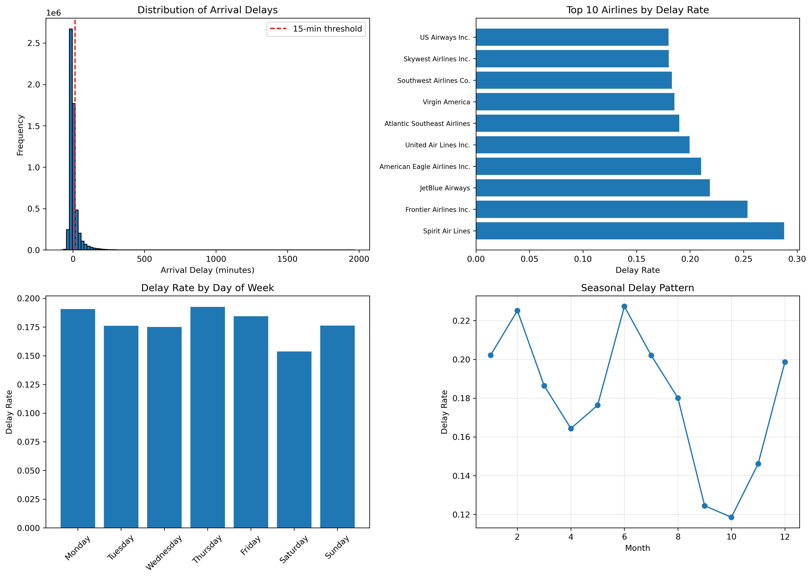
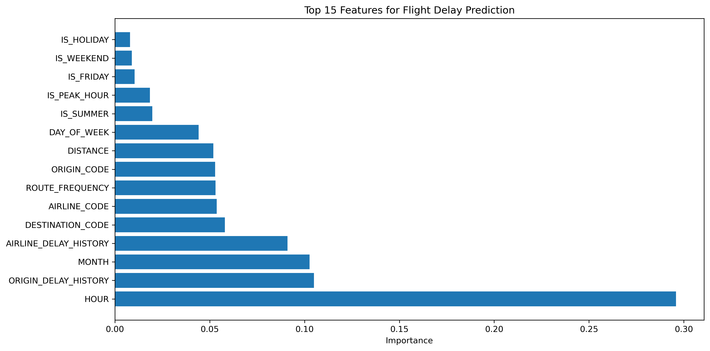

# ✈️ Flight Delay Prediction & Operations Analytics

An end-to-end Data Science project for analyzing airline flight delays, identifying operational patterns, engineering predictive features, and building a machine learning model to predict significant arrival delays.

## 📌 Project Overview

Flight delays have a direct impact on airline operations, passenger experience, aircraft utilization, and scheduling efficiency.

This project analyzes flight data from 2015 to identify:

* Airlines with higher delay rates
* Peak hours associated with delays
* Day-of-week and monthly delay patterns
* Frequently occurring routes
* Airport and airline historical delay patterns
* Important features influencing delay prediction

A Random Forest classification model was developed to predict whether a flight would experience an arrival delay of more than 15 minutes.

---

## 🎯 Objectives

1. Clean and preprocess flight data
2. Perform exploratory data analysis (EDA)
3. Engineer operational and time-based features
4. Analyze flight delay patterns
5. Build a machine learning classification model
6. Evaluate model performance
7. Extract business-oriented insights from the analysis

---

## 📊 Dataset

The project uses three datasets:

* `airlines.csv` — airline information
* `airports.csv` — airport information
* `flights.csv` — flight-level operational data

### Dataset Summary

| Metric                    |     Value |
| ------------------------- | --------: |
| Flights analyzed          | 5,714,008 |
| Year                      |      2015 |
| Airlines                  |        14 |
| Delayed flights (>15 min) | 1,023,498 |
| Delay rate                |     17.9% |

> The raw CSV datasets are intentionally excluded from this GitHub repository because of their large file size.

---

## 🔧 Feature Engineering

Several features were created to capture operational and temporal patterns, including:

* Departure hour
* Arrival hour
* Weekend indicator
* Peak departure indicator
* Route
* Distance category
* Scheduled time category
* Airline historical delay rate
* Origin airport historical delay rate
* Route frequency
* Encoded airline and airport information
* Month and day-of-week features

These features were used for exploratory analysis and machine learning.

---

## 🤖 Machine Learning

### Model

**Random Forest Classifier**

The model was configured with:

* `n_estimators = 100`
* `max_depth = 15`
* `min_samples_split = 10`
* `min_samples_leaf = 5`
* `random_state = 42`

The dataset was divided into training and testing sets using a stratified split.

### Target Variable

A flight was classified as delayed when:

```text
ARRIVAL_DELAY > 15 minutes
```

---

## 📈 Model Results

The model produced the following results on the test dataset:

| Metric    | Result |
| --------- | -----: |
| Accuracy  |  82.1% |
| Precision |  72.7% |
| Recall    |   0.4% |
| ROC-AUC   |  0.690 |

### Interpretation

The accuracy is influenced by the imbalance between delayed and non-delayed flights. The model showed very high performance on the majority class but detected only a small proportion of delayed flights at the default classification threshold.

Therefore, the current model should be considered a baseline model rather than a production-ready delay prediction system.

Further improvements could include:

* Class-weighted training
* Threshold optimization
* Leakage-safe historical features
* Alternative classification algorithms
* Hyperparameter tuning
* Imbalanced-learning techniques
* Time-based validation

---

## 🔍 Business Insights

### Airlines with Higher Delay Rates

The analysis identified the following airlines among those with the highest observed delay rates:

| Airline                      | Delay Rate |
| ---------------------------- | ---------: |
| Spirit Air Lines             |      28.8% |
| Frontier Airlines Inc.       |      25.4% |
| JetBlue Airways              |      21.9% |
| American Eagle Airlines Inc. |      21.0% |
| United Air Lines Inc.        |      20.0% |

### Time-Based Patterns

The analysis identified higher delay activity during:

* Late morning to early afternoon
* Evening peak periods

### Day Pattern

Thursday showed the highest observed delay rate at approximately **19.3%**.

### Monthly Pattern

June showed the highest observed delay rate at approximately **22.7%**.

These patterns can help airlines investigate scheduling, resource allocation, and operational bottlenecks during higher-risk periods.

---

## 📊 Visualizations

### Delay Analysis



### Feature Importance



---

## 🗂️ Project Structure

```text
flight-delay-prediction/
│
├── README.md
├── .gitignore
│
├── Data/                   # Local only, not included in GitHub
│   ├── airlines.csv
│   ├── airports.csv
│   └── flights.csv
│
└── Notebooks/
    ├── flight_delay_analysis.ipynb
    ├── flight_delay_analysis1.ipynb
    ├── delay_analysis.png
    ├── feature_importance.png
    ├── model_metrics.csv
    └── PROJECT_SUMMARY.txt
```

### Files excluded from GitHub

The following files are intentionally excluded using `.gitignore`:

```text
Data/*.csv
*.pkl
.ipynb_checkpoints/
```

This keeps large datasets and serialized model files out of the repository.

---

## 🛠️ Technologies Used

* Python
* Pandas
* NumPy
* Matplotlib
* Seaborn
* Scikit-learn
* Jupyter Notebook
* Git & GitHub

---

## 🚀 How to Run the Project

### 1. Clone the repository

```bash
git clone https://github.com/boddupallykavya9-cloud/flight-delay-prediction.git
cd flight-delay-prediction
```

### 2. Install dependencies

```bash
pip install pandas numpy matplotlib seaborn scikit-learn jupyter
```

### 3. Add the datasets

Place the required CSV files inside:

```text
Data/
```

The required files are:

```text
airlines.csv
airports.csv
flights.csv
```

### 4. Launch Jupyter Notebook

```bash
jupyter notebook
```

Open:

```text
Notebooks/flight_delay_analysis.ipynb
```

and run the notebook cells sequentially.

---

## 💡 Key Takeaways

This project demonstrates an end-to-end Data Science workflow:

**Data → Cleaning → EDA → Feature Engineering → Machine Learning → Evaluation → Business Insights**

The analysis provides a foundation for understanding airline delay patterns and demonstrates how operational data can be transformed into actionable insights.

---

## 🔮 Future Improvements

Potential improvements to the project include:

* Improve minority-class recall
* Address class imbalance
* Prevent historical-feature leakage
* Perform systematic hyperparameter tuning
* Compare Random Forest with XGBoost and other models
* Build a prediction dashboard
* Deploy the model using Flask/FastAPI or Streamlit
* Add real-time flight information
* Develop airline and airport-specific risk scoring

---

## 👩‍💻 Author

**Kavya Boddupally**

MSc Data Science | Aspiring Data Scientist

[GitHub](https://github.com/boddupallykavya9-cloud)
